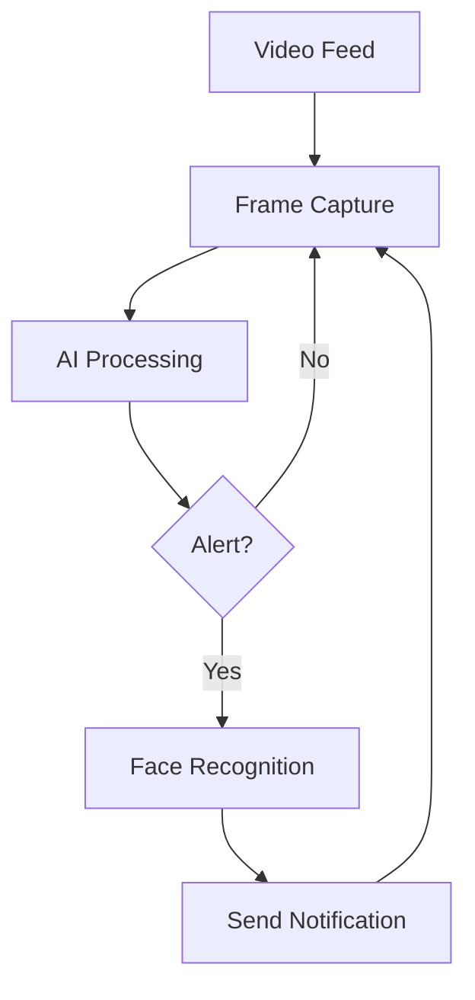

# 🚨 AI-Powered Security Surveillance System

<div align="center">
  
  
  
</div>

## 🎯 Features

- 🕵️‍♂️ Real-time object detection and analysis
- 🚨 Smart alert system with cooldown
- 👤 Face recognition integration
- 📱 Telegram notifications
- ⚡ High-performance processing
- 🛡️ Security-focused design

## 🚀 Getting Started

### Prerequisites
- Python 3.8+
- OpenCV
- Face Recognition library (optional)
- Telegram Bot Token

### Installation
```bash
# Clone the repository
git clone https://github.com/yourusername/reality-search-engine.git
cd reality-search-engine

# Create a virtual environment (recommended)
python -m venv venv
source venv/bin/activate  # On Windows: venv\Scripts\activate

# Install dependencies
pip install -r requirements.txt
```

## 🛠️ Configuration
Create a `.env` file in the root directory:
```env
TELEGRAM_BOT_TOKEN=your_telegram_bot_token
TELEGRAM_CHAT_ID=your_chat_id
ALERT_COOLDOWN=300  # seconds
```

## 🚦 Usage
```bash
# Run the AI processor
python ai_processor.py

# For development with debug mode
python ai_processor.py --debug
```

## 🖥️ System Architecture


## 🤝 Contributing
Contributions are welcome! Please read our [contributing guidelines](CONTRIBUTING.md) before submitting pull requests.

## 📄 License
This project is licensed under the MIT License - see the [LICENSE](LICENSE) file for details.

## 👨‍💻 Author
[Prince Desai] - [@princedesai012](https://github.com/princedesai012)

## 🙏 Acknowledgments
- Thanks to all contributors
- Built with ❤️ using Python

---

<div align="center">
  Made with 🚀 by Prince Desai
</div>
